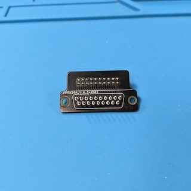

# D-SUB 19 Adapter

This repository contains the KiCad project and Gerber files for an adapter that
converts a D-SUB 19 socket to a 20 pin IDC box header. D-SUB 19 sockets where
used on the Atari ST (DMA/Harddisk connector). They are out of production for a
long time and are extremely hard to get hold of nowadays and expensive. This
Adapter is a cheap workaround. It connects the 19 pins 1:1 to the pins of the
IDC box header, with pin 20 unused. It should be compatible with the so-called
[UltraSatan Cables](http://joo.kie.sk/?page_id=224).

> [!CAUTION]
> Please check carefully if this adapter has the pinout required by your use
> case. I use it for connecting hard drive emulators based on SD cards to my
> Atari ST. It will not work for Apple II Floppy drives, these need another
> pinout!

## Ordering the PCB

The subdirectory "gerber-files" contains a Zip file you can use to order the PCB
from PCB manufacturers like PCBWay or JLCPCB. Simply upload the Zip on their web
page. I recommend to use the standard PCB thickness of 1.6mm and HASL finishing.

## Building the Adapter

### Bill of Materials

* __19x Soldering Pins/Nails 1mm diameter__.

  These pins are used to recreate the D-SUB 19 plug. The length of the shaft
  that sticks into the socket should be at least 6mm. I used
  [these from Reichelt](https://www.reichelt.com/de/en/shop/product/soldering_pins_1_mm_pack_of_100-15321).

* __1x 2x10 Pin Straight Male Box Header 2.54mm pitch__.

  Used to connect the flat ribbon cable to the adapter.

* __2x 2x10 Pin Female IDC Sockets 2.54mm pitch__.

  Used on the flat ribbon cable to the adapter and the external device.

* __1x 20 wire Flat Ribbon cable 1.27mm pitch__.

  Used to connect the external device to the adapter.

### Soldering the Pins

Start with soldering the 19 pins/nails to the PCB. It is crucial that you solder
these pins straight to the PCB, otherwise they will not fit into the socket. I
took an old D-SUB 25 socket from my parts bin and used it as a soldering aid.
You can do the same, or maybe you have an old cable with a D-SUB 25 socket.
Stick the pins into the socket, and attach the PCB to the pins, e.g. by using an
adhesive like [Blu Tack](https://en.wikipedia.org/wiki/Blu_Tack). Solder the
pins to the PCB, but be careful not to destroy your soldering aid by applying
excessive heat or by dropping solder.

### Soldering the Box Header

Solder the Box Header to the PCB. Mind the orientation, the notch of the Header
must face in the direction marked on the silk screen (upwards in the image
below).

### Building the Cable

Connect the two IDC Sockets to the Flat Ribbon cable. There are special tools
for doing so, but you can also use a vise. Pin 1 is marked on the sockets with a
small triangle, and usually with a red stripe on the cable, so make sure to
align pin 1 of the cable with pin 1 on both sockets. Do this whole process with
care - even though it is straightforward, you can easily create shortcuts that
are hard to trace down.

Keep the cable as short as possible - there is no shielding, and the longer the
cable, the more noise gets introduced to the signal. Some sources recommend to
stay below 10cm, so that is what I did.

## Using the Adapter

Carefully push the adapter into the DB-19 socket. I recommend not to push it all
the way in, because it sits quite thight in the socket, and it might be
difficult pull the adapter from the socket later on. Use the cable to connect
your external device to the adapter.

## License

DSUB 19 Adapter (c) by Patrick Dähne

DSUB 19 Adapter is licensed under a
Creative Commons Attribution-NonCommercial-ShareAlike 4.0 International License.

You should have received a copy of the license along with this
work. If not, see <https://creativecommons.org/licenses/by-nc-sa/4.0/>.
